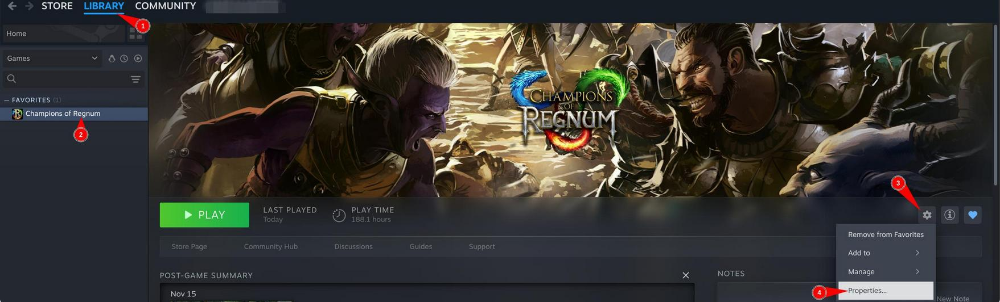

# Using Steam and Proton to play Regnum

It's by far the easiest and less troublesome way to play Regnum on Linux, at the expense of a bigger install size if you're not using Proton already.

On recent Debian and derivative systems, you can install Steam by installing the `steam-installer` package. This is great because you don't need flatpaks anymore.

*We assume steam is already installed, and you've already installed Regnum in your library*

## Accessing game properties

1. Go to your library
2. Choose _**Champions of Regnum**_
3. Click on the _**gear icon**_
4. Click on _**Properties**_

## Move to proton

A new window appears:

1. Click on _**Compatibility**_
2. Check the specific compatibility tool; it's necessary or it will pick the Linux native version instead!
3. Use the latest Proton runtime containing a number, or experimental at your own risks :P

The proton runtime will then be downloaded, and so will the Windows version of the game.

**You're done, have fun!**
