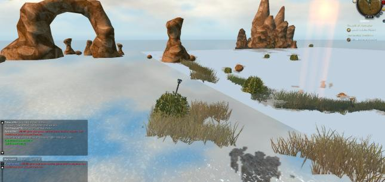
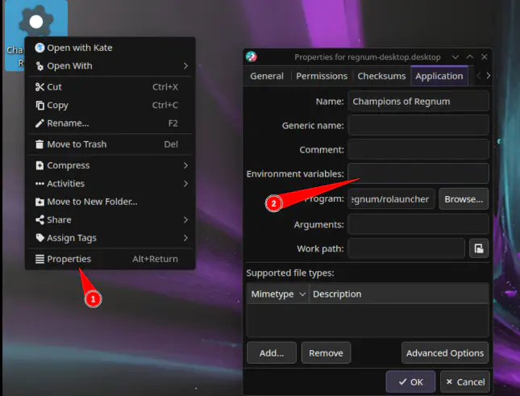

# General troubleshooting

## No textures

You had a blank page at character selection screen, and now ingame you get something like that:



You will need to nerf your GPU to make it a 2009 one. Don't worry, it only applies to the game!

You can modify your launcher icon to use this command line instead :

```sh
/usr/bin/env MESA_EXTENSION_MAX_YEAR=2009 /where/is/regnum/rolauncher
```

### KDE

On KDE, right click on your Regnum icon and:

1. Click on _Properties_
2. Add `MESA_EXTENSION_MAX_YEAR=2009` to _Environment variables_ and click on _OK_.




## Limited FPS

On Linux, vsync is usually the default, whatever you put in the game options.

You can modify your launcher icon to use this command line instead :

```sh
/usr/bin/env vblank_mode=0 /where/is/regnum/rolauncher
```

## Weird thousands separators

The game is in [latin1](https://en.wikipedia.org/wiki/ISO/IEC_8859-1), but modern Linuces use UTF8.

It's mostly a French thing. Check your operating system docs to make the non UTF8 (usually ISO-8859-1) locale available (run `locale -a` to see them).

Once done, you can modify your launcher icon to use this command line instead (example for French) :

```sh
# French example
/usr/bin/env LANG=fr_FR.ISO-8859-1 /where/is/regnum/rolauncher
# Generic, work for any language, but no thousands separator
/usr/bin/env LANG=C /where/is/regnum/rolauncher
```

It"s possible that you need to add that locale to your system if not present:

### Debian and derivatives

```shell
sudo dpkg-reconfigure locales
# tick your language, for example fr_FR for French
# validate the change
# Ensure the locale is well installed
locale -a
```
